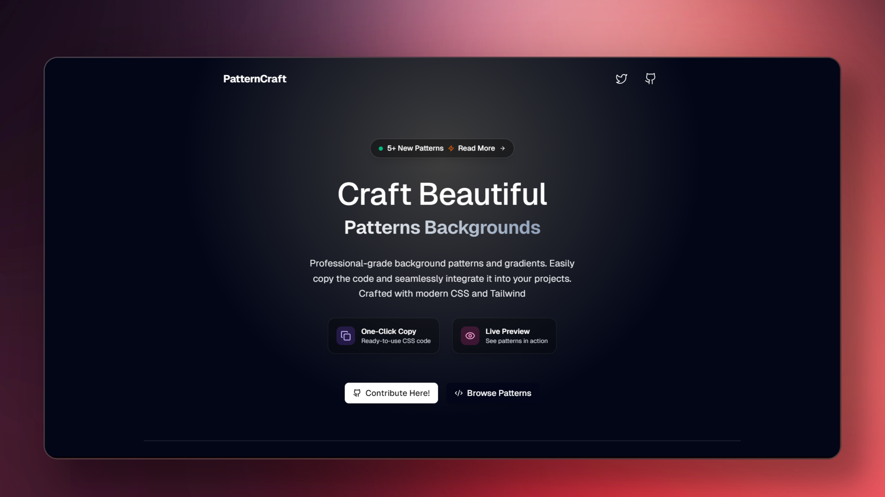
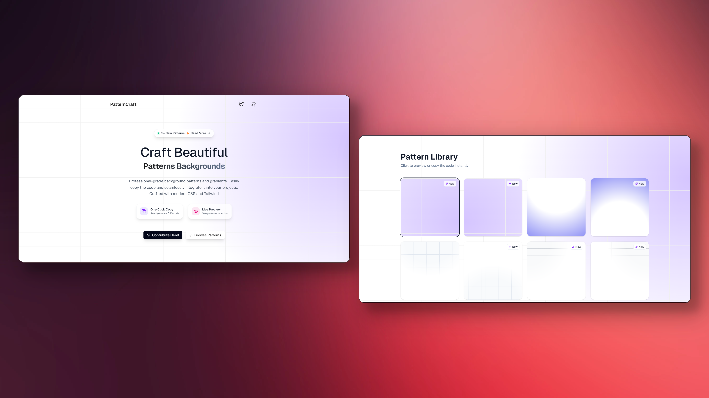

# Pattern Craft

Professional-grade background patterns and gradients for modern web applications. A curated collection of CSS patterns that you can copy and integrate into your projects instantly.

**Visit**: **[https://pattern-craft.vercel.app/](https://pattern-craft.vercel.app/)**




## Features

- **Ready-to-use CSS code** - Copy and paste directly into your projects
- **Live preview** - See patterns in action before implementation
- **Modern design** - Crafted with contemporary CSS techniques and Tailwind CSS
- **Responsive patterns** - Optimized for all screen sizes
- **Zero dependencies** - Pure CSS implementations
- **Pattern categories** - Organized collection for easy browsing

## Tech Stack

- **Next.js 14** - React framework with App Router
- **TypeScript** - Type-safe development
- **Tailwind CSS** - Utility-first CSS framework
- **Vercel** - Deployment and hosting

## Getting Started

### Prerequisites

- Node.js 18+
- npm, yarn, pnpm, or bun

### Installation

1. Clone the repository:

```bash
git clone https://github.com/megh-bari/pattern-craft.git
cd pattern-craft
```

2. Install dependencies:

```bash
npm install
# or
yarn install
# or
pnpm install
```

3. Run the development server:

```bash
npm run dev
# or
yarn dev
# or
pnpm dev
```

4. Open [http://localhost:3000](http://localhost:3000) in your browser

### Build for Production

```bash
npm run build
npm start
```

## How to Use This

1. Visit the live site: **[https://pattern-craft.vercel.app/](https://pattern-craft.vercel.app/)**
2. Browse through the collection of background patterns and gradients.
3. Click on any pattern to open its preview modal.
4. Copy the CSS/Tailwind-compatible code snippet.
5. Paste it into your project wherever needed — it's responsive, clean, and ready to go!

These snippets work great for:

- Hero sections
- Landing pages
- Cards and sections
- Background art

## Demo

[](https://youtu.be/YOUR_VIDEO_ID)

## Usage

1. Browse the pattern collection on the website
2. Click on any pattern to see the live preview
3. Copy the generated CSS code
4. Paste it into your project

Each pattern includes:

- Complete CSS styling
- Tailwind-compatible code
- Responsive implementation
- Cross-browser compatibility

## Contributing

We welcome contributions to expand the pattern collection. To add new patterns:

### Adding New Patterns

1. Fork the repository
2. Create a feature branch:

```bash
git checkout -b feature/new-pattern-name
```

3. Navigate to `src/app/utils/patterns.ts`
4. Add your pattern following the established format:

```typescript
{
  id: "unique-pattern-id",
  name: "Pattern Display Name",
  badge: "New", // Optional: "New", "Popular"
  style: {
    background: "#ffffff",
    backgroundImage: `
      // Your CSS background patterns here
      linear-gradient(to right, #f0f0f0 1px, transparent 1px),
      radial-gradient(circle 800px at 100% 200px, #d5c5ff, transparent)
    `,
    backgroundSize: "96px 64px, 100% 100%",
  },
  code: `<div className="min-h-screen w-full bg-white relative">
  {/* Pattern Name Background */}
  <div
    className="absolute inset-0 z-0"
    style={{
      backgroundImage: \`
        // Your background image styles
      \`,
      backgroundSize: "96px 64px, 100% 100%",
    }}
  />
  {/* Your Content/Components */}
</div>`,
}
```

### Contribution Guidelines

- **Consistency**: Follow the existing pattern structure exactly
- **Naming**: Use descriptive, kebab-case IDs and proper display names
- **Quality**: Ensure patterns are visually appealing and professional
- **Performance**: Optimize for rendering performance
- **Responsiveness**: Test patterns across different screen sizes
- **Uniqueness**: Avoid duplicating existing patterns

### Pattern Categories

Consider these categories when adding patterns:

- **Geometric** - Grids, dots, lines, shapes
- **Gradient** - Color transitions and blends
- **Texture** - Subtle background textures
- **Abstract** - Creative and artistic patterns
- **Minimal** - Clean and simple designs

### Testing Your Patterns

1. Test the pattern in the development environment
2. Verify responsive behavior
3. Check browser compatibility (Chrome, Firefox, Safari, Edge)
4. Ensure code validity and formatting

### Pull Request Process

1. Commit your changes with descriptive messages
2. Push to your feature branch
3. Create a pull request with:
   - Clear description of the pattern added
   - Screenshots or preview of the pattern
   - Any special considerations or notes

```bash
git add .
git commit -m "feat: add new geometric grid pattern"
git push origin feature/new-pattern-name
```

## Development

### Project Structure

```
pattern-craft/
├── src/
│   └── app/
│       ├── components/
│       │   ├── footer.tsx
│       │   ├── hero.tsx
│       │   ├── navbar.tsx
│       │   ├── pattern-showcase.tsx
│       │   └── theme-provider.tsx
│       ├── types/
│       │   └── pattern.ts
│       ├── utils/
│       │   ├── patterns.ts        # Pattern definitions (contribute here)
│       ├── globals.css
│       ├── layout.tsx
│       └── page.tsx
├── components/
│   └── ui/                        # shadcn/ui components
```

### Code Standards

- Use TypeScript for type safety
- Follow ESLint and Prettier configurations
- Maintain consistent code formatting
- Use semantic commit messages

## License

This project is open source and available under the [MIT License](LICENSE).

## Acknowledgments

- Built with Next.js and Tailwind CSS
- Inspired by modern web design patterns
- Community-driven pattern collection

## Support

For questions, issues, or suggestions:

- Open an issue on GitHub
- Check existing issues before creating new ones
- Provide detailed information for bug reports

## Built By

- Twitter: [@meghtrix](https://x.com/meghtrix)
- GitHub: [@megh-bari](https://github.com/megh-bari)

If you like this project, consider giving it a ⭐️ on GitHub and sharing it with others!

**Happy coding!**

---
