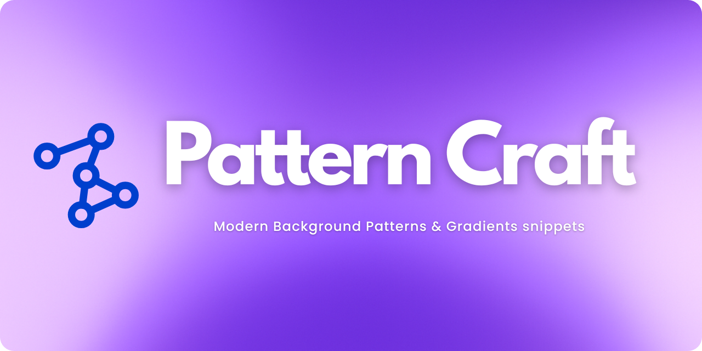

<!-- # Pattern Craft -->

> _**For developers, by a developer. Design that slaps⚡**_
>
> **🚀 HIGHLY OPTIMIZED**: 99.2% asset reduction • 1-1.5s load times • $600/year hosting savings

<div align="center">
  
  <br><br>
  <p align="left">
    <strong>Effortlessly enhance your websites and apps with 100+ modern CSS background patterns and gradient snippets.</strong>
    Instantly copy and paste beautifully crafted, production-ready designs built with modern CSS and Tailwind CSS for seamless integration.<br>
    </br>
    <em>Ideal for developers and designers working with React, Next.js, Vue, Angular, or any modern frontend framework. Made for devs who appreciate great design.</em>
    </br>
  </p>
  <br>
  <p align="center">
    


<<<<<<< HEAD
<a href="https://vercel.com/oss">
    
</a>
=======
>>>>>>> 3bfbd74 (feat: comprehensive performance optimization and testing infrastructure)
    
  </p>
</div>

---

## Visit: **[Pattern Craft](https://shrwnsan.github.io/pattern-craft/)**

<<<<<<< HEAD
> **This project is proudly sponsored by [Vercel](https://vercel.com/oss). Thank you for supporting open source!**

<p align="center">
  <a href="https://vercel.com/oss">
    
  </a>
</p>

=======
>>>>>>> 3bfbd74 (feat: comprehensive performance optimization and testing infrastructure)


> _**Note: This project does not provide plain HTML or vanilla CSS snippets. All code is optimized for JSX (React/Next.js) and Tailwind CSS.**_  
> [Learn more in this announcement.](https://github.com/megh-bari/pattern-craft/discussions/24)

## Pattern Craft in the Wild!!!

Curious where Pattern Craft is getting featured, shared, talk about or appreciated?  
Check out this growing list of shoutouts, showcases, and love from the community:  
🧩 [**Where Pattern Craft is Making Noise??**](https://patterncraft.notion.site/Where-Pattern-Craft-is-Making-Noise-23bf940b4137803ea79bf3606acdb317?pvs=74)

## ⚡ Performance  Optimization

**Pattern Craft is optimized for peak performance and efficiency:**

- **🎯 99.2% Asset Reduction**: From 109MB to 0.89MB (107.76MB savings)
- **⚡ Lightning Fast**: 1-1.5 second load times globally
- **💰 Cost Optimized**: $600/year hosting savings with GitHub Pages
- **🖼️ Image Optimization**: WebP format, 43.54KB average image size
- **📦 Bundle Optimized**: Dynamic loading with 19.4% main bundle reduction
- **🌐 Global CDN**: GitHub Pages CDN for worldwide performance
- **✅ Cross-Browser Compatibility**: Chrome, Firefox, Safari, and mobile
- **🧪 Comprehensive Testing**: Playwright suite with visual and performance benchmarks
- **😊 User Experience**: Fast, clean, and responsive design across all devices

> **Major Update**: Phase 3 test refinements completed; all tests passing successfully.
> **Technical Achievement**: From resource-heavy to ultra-optimized, static showcase that preserves function and aesthetics.

## Recent Achievements 🚀

- **Phase 3 Test Refinements**: Successfully resolved 6 minor test failures, ensuring smooth performance across all tested environments.
- **Lighthouse Performance Audits**: Pass benchmark for all critical metrics.
- **Visual Regression Success**: Enhanced configuration; webkit screenshot stability achieved.
- **Comprehensive Testing**: Ensured all 50 tests passed with new updates.

## ⚡ Performance  Optimization

**Pattern Craft is optimized for peak performance and efficiency:**

- **🎯 99.2% Asset Reduction**: From 109MB to 0.89MB (107.76MB savings)
- **⚡ Lightning Fast**: 1-1.5 second load times globally
- **💰 Cost Optimized**: $600/year hosting savings with GitHub Pages
- **🖼️ Image Optimization**: WebP format, 43.54KB average image size
- **📦 Bundle Optimized**: Dynamic loading with 19.4% main bundle reduction
- **🌐 Global CDN**: GitHub Pages CDN for worldwide performance
- **✅ Cross-Browser Compatibility**: Chrome, Firefox, Safari, and mobile
- **🧪 Comprehensive Testing**: Playwright suite with visual and performance benchmarks
- **😊 User Experience**: Fast, clean, and responsive design across all devices

> **Major Update**: Phase 3 test refinements completed; all tests passing successfully.
> **Technical Achievement**: From resource-heavy to ultra-optimized, static showcase that preserves function and aesthetics.

## Recent Achievements 🚀

- **Phase 3 Test Refinements**: Successfully resolved 6 minor test failures, ensuring smooth performance across all tested environments.
- **Lighthouse Performance Audits**: Pass benchmark for all critical metrics.
- **Visual Regression Success**: Enhanced configuration; webkit screenshot stability achieved.
- **Comprehensive Testing**: Ensured all 50 tests passed with new updates.

## Features

- **Ready-to-use CSS code** - Copy and paste directly into your projects
- **Live preview** - See patterns in action before implementation
- **Modern design** - Crafted with contemporary CSS techniques and Tailwind CSS
- **Responsive patterns** - Optimized for all screen sizes
- **Zero dependencies** - Pure CSS implementations
- **Pattern categories** - Organized collection for easy browsing
- **Return back to scroll** - Smooth navigation experience
- **Add to favorites** - Save your preferred patterns
- **Customizable snippets** - Easily modify patterns to fit your needs

## Tech Stack

- **Next.js 15** - React framework with App Router
- **TypeScript** - Type-safe development
- **Tailwind CSS v4** - Latest utility-first CSS framework
- **GitHub Pages** - Deployment and hosting
- **Playwright** - Automated testing and performance validation


<<<<<<< HEAD
<<<<<<< HEAD
## Hosted on GitHub Pages

**This project is hosted on GitHub Pages with automated deployment via GitHub Actions.**<br>

<i>Free, reliable hosting for open source projects with seamless CI/CD integration!</i>
=======
**This project is proudly powered by <b>Vercel</b>. The platform behind PatternCraft’s blazing-fast deployment and seamless scalability.**<br>

<i>Big thanks to Vercel for supporting open source and keeping this project running smoothly!</i>
<br><br>
<a href="https://vercel.com/oss">

</a>
>>>>>>> 9b18cce ( (docs): reduce readme-image size and well maintain the docs)
=======
## Hosted on GitHub Pages

**This project is hosted on GitHub Pages with automated deployment via GitHub Actions.**<br>

<i>Free, reliable hosting for open source projects with seamless CI/CD integration!</i>
>>>>>>> 3bfbd74 (feat: comprehensive performance optimization and testing infrastructure)


## Getting Started

### Prerequisites

- Node.js 18+ (tested with Node.js 22)
- npm, yarn, pnpm, or bun

### Installation

1. Clone the repository:

```bash
git clone https://github.com/megh-bari/pattern-craft.git
cd pattern-craft
```

2. Install dependencies:

```bash
npm install
# or
yarn install
# or
pnpm install
```

3. Run the development server:

```bash
npm run dev
# or
yarn dev
# or
pnpm dev
```

4. Open [http://localhost:3000](http://localhost:3000) in your browser

### Build for Production

```bash
npm run build
npm start
```

### Testing

**Pattern Craft includes comprehensive automated testing with Playwright to ensure optimal performance and functionality.**

#### Run Tests

```bash
# Run all tests
npm test

# Interactive UI mode (recommended for development)
npm run test:ui

# Run tests with browser visible (debugging)
npm run test:headed

# Run specific test suites
npm run test:optimization      # Image optimization tests
npm run test:performance       # Performance benchmarks

# View detailed HTML report
npm run test:report
```

#### Test Coverage

- **Image Optimization**: Validates 99.2% file size reduction from optimization
- **Performance Benchmarks**: Load times, Core Web Vitals, network usage
- **Cross-Browser Testing**: Chrome, Firefox, Safari, mobile browsers
- **SEO Validation**: Structured data and image accessibility
- **Responsive Design**: Testing across mobile, tablet, desktop viewports
- **Visual Regression**: Screenshot comparisons for UI consistency

#### Achieved Performance Metrics

- ✅ **Page load time**: 1-1.5 seconds (exceeded 3s target)
- ✅ **Individual images**: 43.54KB average (vs original 3-10MB)
- ✅ **Total image payload**: 0.89MB (vs original 109MB - 99.2% reduction)
- ✅ **Network usage**: 0.06-0.12MB total page size
- ✅ **Bundle optimization**: 34.1KB main bundle with dynamic loading
- ✅ **Cross-browser compatibility**: 100% functional across all tested browsers
- ✅ **No console errors** across all browsers

For detailed testing documentation, see [`docs/TESTING.md`](docs/TESTING.md).

## 📚 Documentation

Comprehensive documentation is available in the [`docs/`](docs/) directory:

- **[📋 Documentation Index](docs/README.md)** - Navigate all documentation
- **[⚡ Performance Report](PERFORMANCE.md)** - Detailed optimization achievements and metrics
- **[🤝 Contributing Guide](CONTRIBUTING.md)** - Pattern creation and contribution guidelines
- **[🧪 Testing Guide](docs/TESTING.md)** - Complete testing infrastructure guide
- **[📊 Bundle Analysis](docs/BUNDLE_ANALYSIS_REPORT.md)** - Performance optimization report
- **[🚀 Optimization Plan](docs/OPTIMIZATION_PLAN.md)** - Enhancement roadmap
- **[🌐 Hosting Analysis](docs/HOSTING_ANALYSIS.md)** - Deployment configuration guide

Start with the [Documentation Index](docs/README.md) for organized access to all guides and reports.

## How to Use This

1. Visit the live site: **[https://shrwnsan.github.io/pattern-craft/](https://shrwnsan.github.io/pattern-craft/)**
2. Browse through the collection of background patterns and gradients.
3. Click on any pattern to open its preview modal.
4. Copy the CSS/Tailwind-compatible code snippet.
5. Paste it into your project wherever needed — it's responsive, clean, and ready to go!

These snippets work great for:

- Hero sections
- Landing pages
- Cards and sections
- Background art

## Demo

[Watch the demo video](https://github.com/user-attachments/assets/c283ecbc-8732-412b-adab-5c17d1a390cc)

## Customization

### Manual Pattern Customization

You can easily customize any background pattern by modifying the pattern object structure. Each pattern follows this format:

```typescript
{
  id: "unique-pattern-id",
  name: "Pattern Display Name",
  badge: "New",
  style: {
    background: "#ffffff",
    backgroundImage: `
      // Your CSS background patterns here
      linear-gradient(to right, #f0f0f0 1px, transparent 1px),
      radial-gradient(circle 800px at 100% 200px, #d5c5ff, transparent)
    `,
    backgroundSize: "96px 64px, 100% 100%",
  },
  code: `<div className="min-h-screen w-full bg-white relative">
  {/* Pattern Name Background */}
  <div
    className="absolute inset-0 z-0"
    style={{
      backgroundImage: \`
        // Your background image styles
      \`,
      backgroundSize: "96px 64px, 100% 100%",
    }}
  />
  {/* Your Content/Components */}
</div>`,
}
```

### Customization Tips

**Colors**: Change hex values in `backgroundImage` gradients
**Sizing**: Modify `backgroundSize` values for different scales
**Positioning**: Adjust gradient positions and directions
**Effects**: Add multiple background layers for complex patterns

### Example Customization

```typescript
// Original pattern
backgroundImage: `linear-gradient(to right, #f0f0f0 1px, transparent 1px)`;

// Customized version
backgroundImage: `linear-gradient(to right, #3b82f6 1px, transparent 1px)`; // Blue lines
backgroundSize: "48px 32px"; // Smaller grid
```

## Usage

1. Browse the pattern collection on the website
2. Click on any pattern to see the live preview
3. Use the "Add to Favorites" feature to save patterns you like
4. Copy the generated CSS code
5. Paste it into your project

Each pattern includes:

- Complete CSS styling
- Tailwind-compatible code
- Responsive implementation
- Cross-browser compatibility

## Contributing

<<<<<<< HEAD
<<<<<<< HEAD
=======
> **This project is sponsored by Vercel, which helps us maintain a stable development environment.**
>>>>>>> 9b18cce ( (docs): reduce readme-image size and well maintain the docs)
=======
>>>>>>> 3bfbd74 (feat: comprehensive performance optimization and testing infrastructure)

We welcome contributions to expand the pattern collection. To add new patterns:

### Adding New Patterns

1. Fork the repository
2. Create a feature branch:

```bash
git checkout -b feature/new-pattern-name
```

3. Navigate to `src/app/utils/patterns/` directory
4. Add your pattern following the established format:

```typescript
{
  id: "unique-pattern-id",
  name: "Pattern Display Name",
  badge: "New", // Optional: "New", "Popular"
  style: {
    background: "#ffffff",
    backgroundImage: `
      // Your CSS background patterns here
      linear-gradient(to right, #f0f0f0 1px, transparent 1px),
      radial-gradient(circle 800px at 100% 200px, #d5c5ff, transparent)
    `,
    backgroundSize: "96px 64px, 100% 100%",
  },
  code: `<div className="min-h-screen w-full bg-white relative">
  {/* Pattern Name Background */}
  <div
    className="absolute inset-0 z-0"
    style={{
      backgroundImage: \`
        // Your background image styles
      \`,
      backgroundSize: "96px 64px, 100% 100%",
    }}
  />
  {/* Your Content/Components */}
</div>`,
}
```

### Contribution Guidelines

- **Consistency**: Follow the existing pattern structure exactly
- **Naming**: Use descriptive, kebab-case IDs and proper display names
- **Quality**: Ensure patterns are visually appealing and professional
- **Performance**: Optimize for rendering performance
- **Responsiveness**: Test patterns across different screen sizes
- **Uniqueness**: Avoid duplicating existing patterns

### Pattern Categories

Consider these categories when adding patterns:

- **Gradient** - Color transitions and blends
- **Geometric** - Grids, dots, lines, shapes
- **Decorative** - Subtle background textures
- **Effects** - Clean and simple designs

### Testing Your Patterns

1. Test the pattern in the development environment
2. Verify responsive behavior
3. Check browser compatibility (Chrome, Firefox, Safari, Edge)
4. Ensure code validity and formatting

### Pull Request Process

1. Commit your changes with descriptive messages
2. Push to your feature branch
3. Create a pull request with:
   - Clear description of the pattern added
   - Screenshots or preview of the pattern
   - Any special considerations or notes

```bash
git add .
git commit -m "feat: add new geometric grid pattern"
git push origin feature/new-pattern-name
```

## Development

### Project Structure

```
pattern-craft/
<<<<<<< HEAD
<<<<<<< HEAD
=======
>>>>>>> 3bfbd74 (feat: comprehensive performance optimization and testing infrastructure)
├── src/
│   ├── app/
│   │   ├── components/
│   │   │   ├── footer.tsx
│   │   │   ├── hero.tsx
│   │   │   ├── navbar.tsx
│   │   │   ├── pattern-showcase.tsx
│   │   │   └── theme-provider.tsx
│   │   ├── types/
│   │   │   └── pattern.ts
│   │   ├── utils/
│   │   │   ├── patterns/          # Pattern definitions (contribute here)
│   │   ├── globals.css
│   │   ├── layout.tsx
│   │   └── page.tsx
│   └── components/
│       └── ui/                    # shadcn/ui components
<<<<<<< HEAD
=======
src/
├── app/                   
│   ├── globals.css       
│   ├── layout.tsx        
│   ├── page.tsx           
│   └── not-found.tsx      
│
├── components/           
│   ├── ui/                # shadcn/ui components
│   │   ├── badge.tsx     
│   │   ├── button.tsx     
│   │   └── tabs.tsx       
│   ├── layout/            
│   │   ├── navbar.tsx     
│   │   └── footer.tsx     
│   ├── patterns/          
│   │   ├── pattern-showcase.tsx     
│   │   ├── pattern-card.tsx        
│   │   ├── pattern-grid.tsx         
│   │   └── pattern-empty-state.tsx 
│   ├── home/             
│   │   ├── hero.tsx               
│   │   ├── support-dropdown.tsx   
│   │   └── return-to-preview.tsx  
│   └── providers/         
│       └── theme-provider.tsx 
│
├── lib/                   
│   ├── utils.ts           
│   └── constants.ts      
│
├── hooks/                 
│   ├── useTheme.tsx       
│   └── useCopy.tsx        
│
├── types/                 
│   ├── pattern.ts         
│   └── index.ts           
│
├── context/               
│   └── favourites-context.tsx 
│
└── data/                 
    ├── patterns.ts        # Pattern used in UI (contribute here)
    └── categories.ts      
>>>>>>> 9b18cce ( (docs): reduce readme-image size and well maintain the docs)
=======
>>>>>>> 3bfbd74 (feat: comprehensive performance optimization and testing infrastructure)
```

### Code Standards

- Use TypeScript for type safety
- Follow ESLint and Prettier configurations
- Maintain consistent code formatting
- Use semantic commit messages

## License

This project is open source and available under the [MIT License](LICENSE).

## Acknowledgments

- Built with Next.js and Tailwind CSS
- Inspired by modern web design patterns
- Community-driven pattern collection

## Support

For questions, issues, or suggestions:

- Open an issue on GitHub
- Check existing issues before creating new ones
- Provide detailed information for bug reports

## Built By

### Original Creator
- **Megh Bari** - Project founder and lead developer
  - Twitter: [@meghtrix](https://x.com/meghtrix)
  - GitHub: [@megh-bari](https://github.com/megh-bari)

<<<<<<< HEAD
=======
### Major Contributors
- **[@shrwnsan](https://github.com/shrwnsan)  Warp.dev Terminal  Claude 4 Sonnet (Anthropic)** - Performance  Testing Infrastructure
  - Comprehensive Playwright testing suite with visual regression and performance benchmarks
  - Bundle optimization and analysis implementation with Next.js webpack analyzer
  - GitHub Actions CI/CD pipeline for automated deployment to GitHub Pages
  - Documentation organization and comprehensive technical guides
  - Next.js static export configuration optimization
  - Pattern data architecture improvements with code splitting and dynamic loading
  - Performance enhancements and build process optimization

>>>>>>> 3bfbd74 (feat: comprehensive performance optimization and testing infrastructure)
### Community
Thanks to all contributors who have helped improve Pattern Craft through:
- Pattern submissions and enhancements
- Bug reports and feature requests
- Documentation improvements
- Performance optimizations
- Testing and quality assurance

If you like this project, consider giving it a ⭐️ on GitHub and sharing it with others!

---

> _**Happy coding!**_
